# whyred NetHunter Kernel

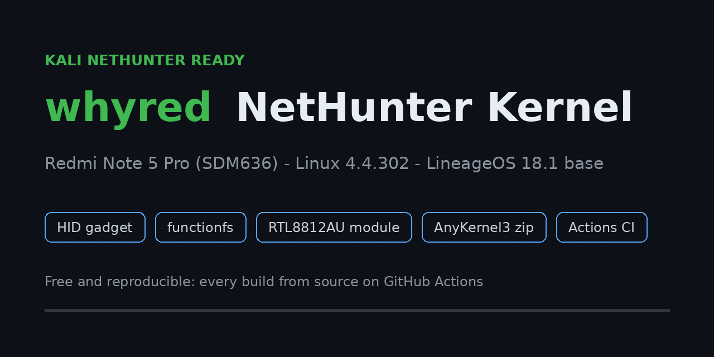

Custom kernel for the **Xiaomi Redmi Note 5 Pro (whyred, SDM636)** that turns a
LineageOS 18.1-class ROM into a Kali NetHunter capable platform. Built by
GitHub Actions, shipped as a flashable AnyKernel3 zip, zero paid tools.

**Latest release: [v1.2](https://github.com/notatallnic189/whyred-nethunter-kernel/releases/tag/v1.2), installer that explains itself, clean version strings, leaner zip. Verified end to end on a real device twice: kernel, NetHunter app and Kali chroot (see below)**

**Community:** [XDA support thread](https://xdaforums.com/t/kernel-whyred-nethunter-kernel-for-los-18-1-hid-gadget-rtl8812au-injection-ci-built.4800231/) | [Telegram channel t.me/whyrednethunter](https://t.me/whyrednethunter) (release announcements, flash help) | [landing page](https://notatallnic189.github.io/whyred-nethunter-kernel/)

Base: `LineageOS/android_kernel_xiaomi_sdm660` @ `lineage-18.1` (Linux 4.4.302)

Actively maintained as of September 2026. Project landing page: <https://notatallnic189.github.io/whyred-nethunter-kernel/>

## Verified on real hardware

Two full verification passes were executed on a physical whyred, both off
official release zips, not on an emulator and not on paper:

- Pass 1 (2026-09-11), v1.1.1 zip (sha256
  `4ecfa4152cb2c2ec57d2cb7a449cde1206f4a181ccec8735a76ac384a3915329`):
  flash, root, systemless modules, WireGuard loaded, live string
  `4.4.302-Nethunter-whyred-g2e69f2ae550d-dirty` (the `-dirty` suffix was
  expected on v1.1.x builds).
- Pass 2 (2026-09-12), v1.2 zip (sha256
  `e384b892b8d851734345aabbff8ed580a0264c408361322998aa256098c1376e`):
  same chain with the fixed installer and, on top of it, the full NetHunter
  userland: app + Kali chroot + terminal, all live on the device.

Common to both passes:

- ROM: official LineageOS 18.1, build `lineage_whyred-userdebug 11 RQ3A.211001.001 0853d55ab8`
- TWRP flash: `Magisk detected! Patching kernel so reflashing Magisk is not necessary...` + `Creating kernel helper systemless module...`
- Root: Magisk 30.7, `uid=0` with context `u:r:magisk:s0`, SELinux `Enforcing`
- Systemless helper: `/data/adb/modules/ak3-helper` carries the signed `88XXau.ko` (v1.2 zips ship only this module, WireGuard is built in)
- WireGuard: built into the kernel, `wireguard: WireGuard 1.0.20210606 loaded` shows in `dmesg` at boot

Pass 2 adds the userland proof:

- Kernel live: `4.4.302-Nethunter-whyred-g964fc73178ae`, no `-dirty`, read
  straight from the NetHunter app
- NetHunter app: Root Status `30.7:MAGISKSU`, NetHunter Terminal detected
- Kali chroot: `/data/local/nhsystem/kali-arm64` installed and `Running!`
- Chroot terminal: `root@kali` prompt, `uid=0`, `uname -r` = the clean
  string above, `PRETTY_NAME="Kali GNU/Linux Rolling"`

| TWRP flash v1.2 zip | Kernel string in the app | Chroot Manager |
|---|---|---|
| 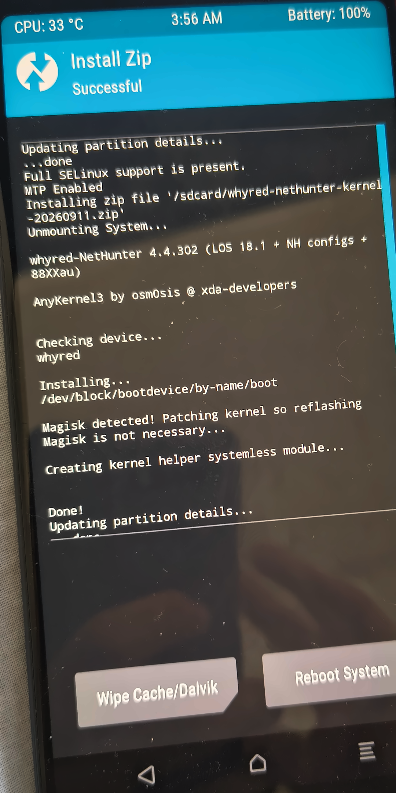 | 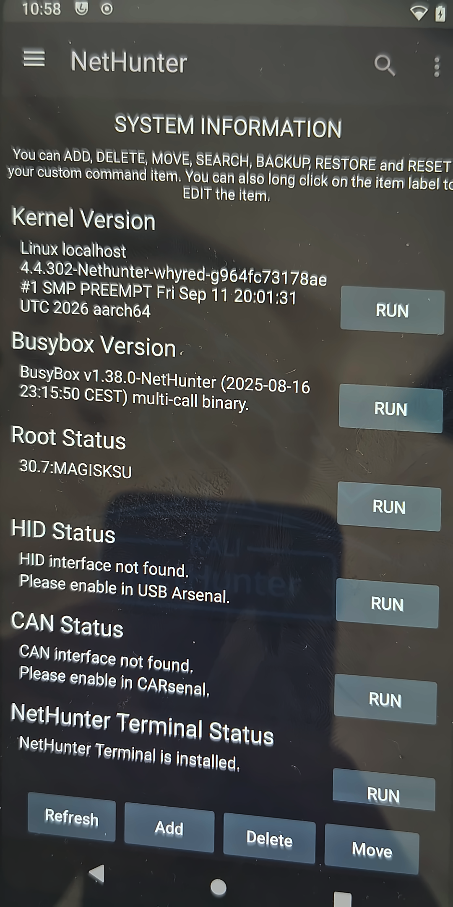 | 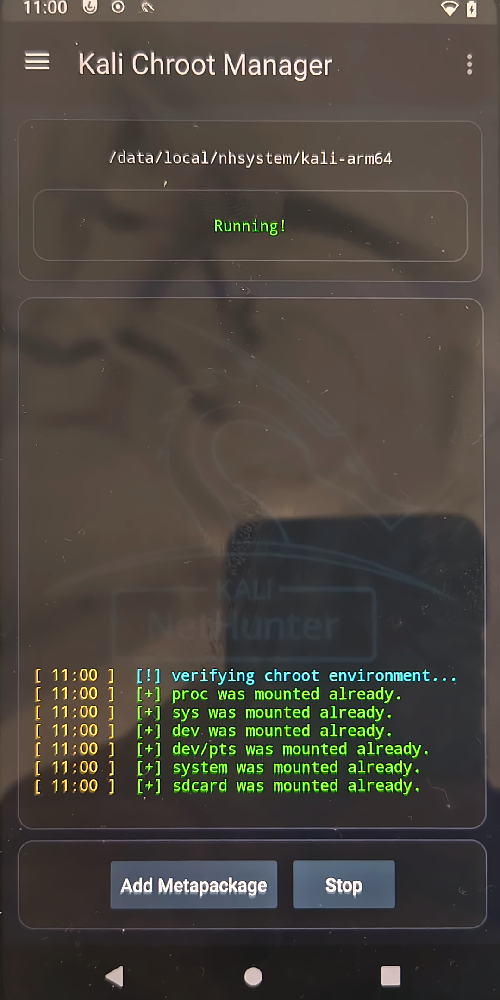 |

| Kali chroot terminal: root, uname, Rolling |
|---|
| 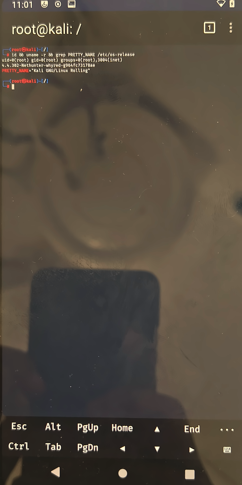 |

| About phone | Model + Android 11 | Build number |
|---|---|---|
| 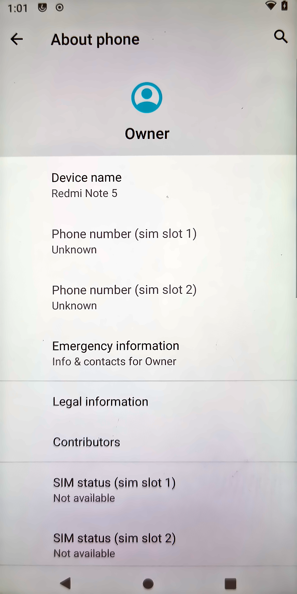 | 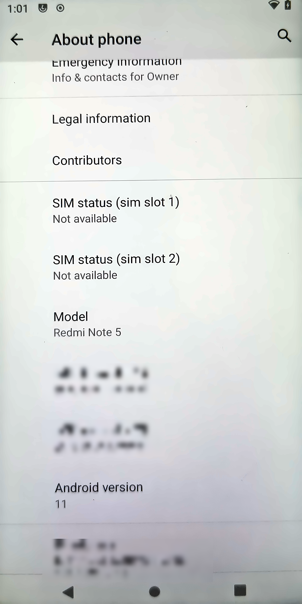 | 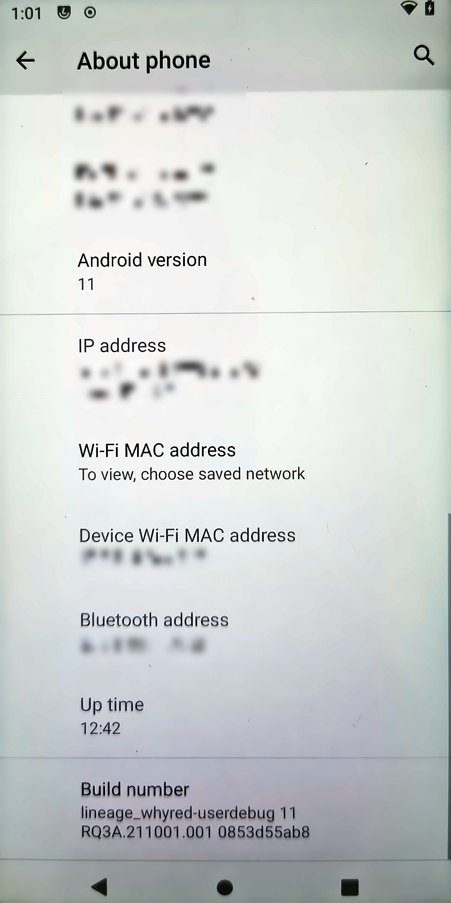 |

| TWRP install log | Magisk module | TWRP log (alt) |
|---|---|---|
| 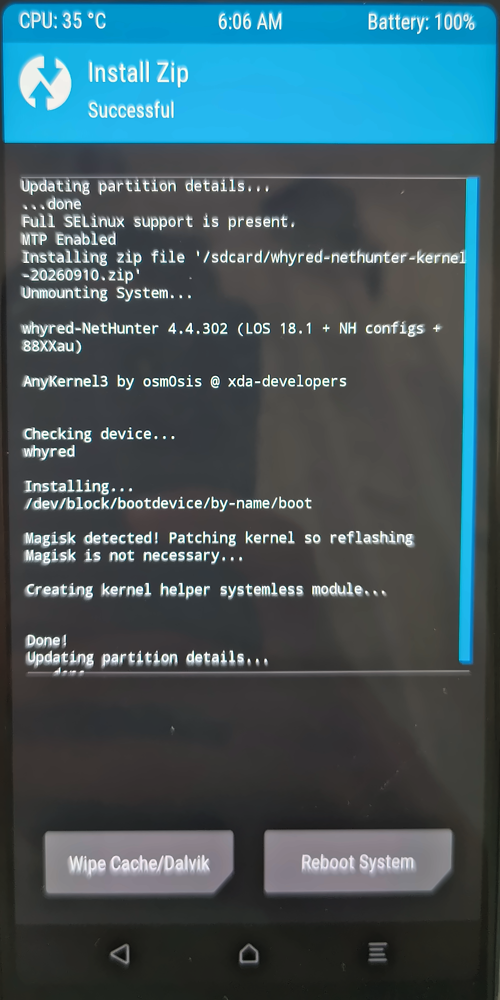 | 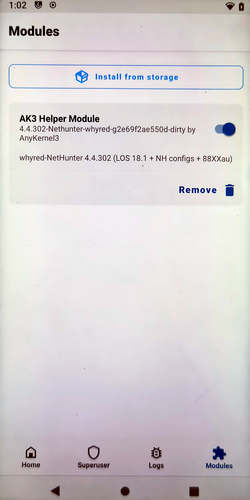 | 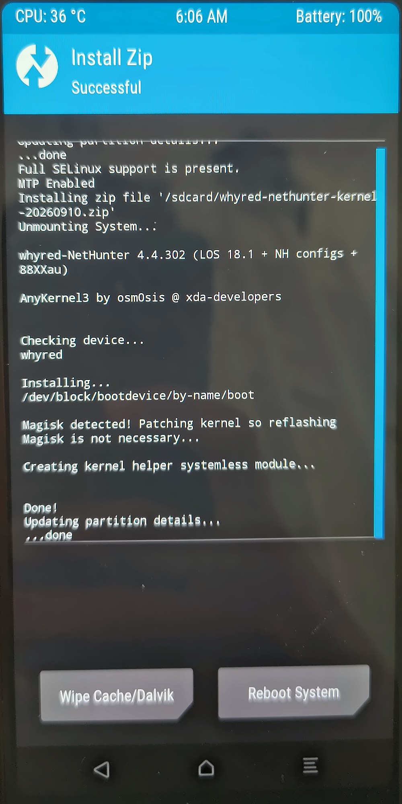 |

Found a bug with this process? The v1.1.0 zip aborted on the first real flash
(`Unable to determine partition`), it was fixed the same day and re-released
as v1.1.1. The device that caught it is the device in the photos.

## What's in the kernel (vs stock LOS defconfig)

| Option | Why NetHunter needs it |
|---|---|
| `CONFIG_USB_CONFIGFS_F_HID=y` | HID gadget for DuckHunter / keystroke injection via OTG |
| `CONFIG_USB_CONFIGFS_F_FS=y` | functionfs for NetHunter USB gadget plumbing |
| `CONFIG_FW_LOADER_USER_HELPER=y` | firmware loading for external WiFi adapters |
| `# CONFIG_ANDROID_PARANOID_NETWORK` not set | chroot/proot tools can bind sockets without AID_INET |
| `CONFIG_MODULES=y` + `CONFIG_MODULE_UNLOAD=y` | out-of-tree module support |
| `CONFIG_WIREGUARD=y` | WireGuard VPN in-kernel, loads at boot (verified via dmesg) |
| `CONFIG_LOCALVERSION="-Nethunter-whyred"` | identifiable via `uname -a` |

## External WiFi adapter: rtl8812au monitor mode + injection

`88XXau.ko` (aircrack-ng rtl8812au v5.6.4.2, signed with the kernel build key,
vermagic locked to this kernel) is bundled in the AnyKernel3 zip and installed
systemlessly via an ak3-helper Magisk module. Supports RTL8812AU/8821AU/8814AU
class adapters: monitor mode and packet injection via OTG.

Honest status: the systemless install of the driver is verified on a real
device (see the Magisk photo above), the monitor mode + injection test on an
actual adapter is still pending because no RTL8812AU class adapter was on
hand at release time. It is the only NetHunter feature not yet exercised
end to end, everything else in this README was.

## WireGuard VPN built in (verified at boot)

The defconfig sets `CONFIG_WIREGUARD=y`: WireGuard 1.0.20210606 is compiled
into the kernel image and loads by itself at boot, before Android even
finishes starting. Verified on device with `dmesg`. Bring your own config and
run `wg-quick up` from the NetHunter chroot or point the Android WireGuard
app at it. No module loading needed.

The v1.0.0 to v1.1.1 zips also carried a signed out-of-tree `wireguard.ko` next
to `88XXau.ko` as a belt and suspenders fallback for ROM trees where the option is
not set. Since the built-in one loads first, starting from v1.2 CI skips packaging
the redundant module when `CONFIG_WIREGUARD=y` is detected in the build config,
so v1.2+ zips ship only `88XXau.ko`.

## Why this instead of the 2020 Team-420 kernel

Team-420 proved NetHunter on whyred was possible, full respect. This project
continues the idea with a modern, reproducible pipeline:

| | Team-420 (2020) | this kernel |
|---|---|---|
| Builds | one off manual releases | every push on GitHub Actions, zips as artifacts |
| Source | frozen | patches and config in the open, rebuildable anywhere |
| Modules | unsigned, permissive expectations | signed with the kernel build key, `MODULE_SIG_FORCE` stays on |
| VPN | not available | WireGuard built into the kernel (verified), signed fallback module |
| LOS base | old trees | current `lineage-18.1` head, rebaseable |
| Proof | forum screenshots | end to end verification on real hardware, photos in this README |
| Rollback | manual | AnyKernel3, just restore `boot` from your nandroid |

## Screenshots

Listed upstream in the official Kali NetHunter kernels page
(nethunter.kali.org/kernels.html):

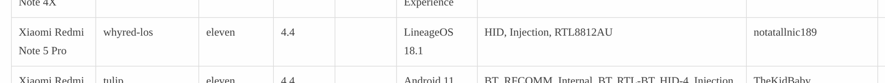

Every zip is built on GitHub Actions and attached to the release with its
sha256 file:

| [releases](https://github.com/notatallnic189/whyred-nethunter-kernel/releases) | [CI runs](https://github.com/notatallnic189/whyred-nethunter-kernel/actions) |
|---|---|
| 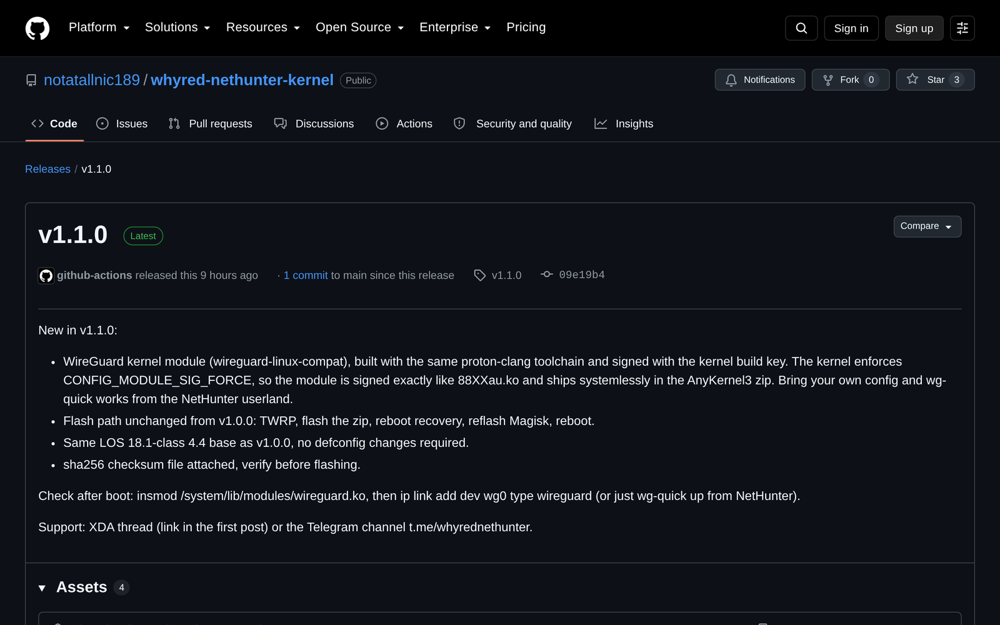 | 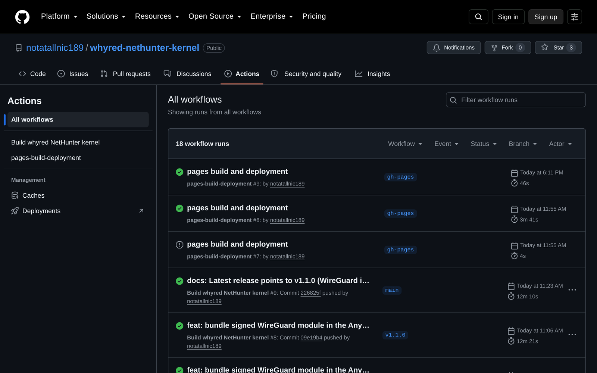 |

Device side proof shots live in the [Verified on real hardware](#verified-on-real-hardware) section above.

## Flash it (LineageOS 18.1, verified flow)

Download: [v1.2 zip](https://github.com/notatallnic189/whyred-nethunter-kernel/releases/download/v1.2/whyred-nethunter-kernel-20260911.zip) +
[sha256](https://github.com/notatallnic189/whyred-nethunter-kernel/releases/download/v1.2/whyred-nethunter-kernel-20260911.zip.sha256).
v1.2 sha256: `e384b892b8d851734345aabbff8ed580a0264c408361322998aa256098c1376e`.
Always verify the hash before flashing.

**Order A, kernel first (this is what the photos above show):**

1. Boot TWRP, take a full nandroid backup (boot + system + data).
2. Flash the zip. The kernel is written and live after reboot, but the
   modules are SKIPPED at this point: Magisk is not in the boot image yet,
   and AnyKernel3 installs systemless modules only when it can see Magisk
   or KernelSU. This is the famous `Skipped!`, see
   [Troubleshooting](#troubleshooting).
3. Boot to system, install the Magisk app, root the CURRENT boot image:
   `dd if=/dev/block/bootdevice/by-name/boot of=/sdcard/nh-boot.img`,
   patch that img in the Magisk app, `fastboot flash boot magisk_patched.img`.
4. Reboot TWRP and flash the SAME zip again. Now you get
   `Magisk detected! ... Creating kernel helper systemless module...` and
   `88XXau.ko` lands in `/data/adb/modules/ak3-helper`
   (systemless, your system partition stays untouched). Since v1.2 the
   zip carries only `88XXau.ko`: WireGuard is built into the kernel and
   the redundant module is skipped by the build.

**Order B, root first (single flash):**

1. Root the stock LOS boot with Magisk first (patch + flash boot).
2. Flash the zip once: Magisk is detected, kernel written, modules
   installed, all in the same pass. No reflash needed.

**Verify after boot:**

- `adb shell uname -a` shows `4.4.302-Nethunter-whyred-...`
- `su -c ls /data/adb/modules/ak3-helper/system/lib/modules` shows `88XXau.ko` (the helper module; WireGuard is built-in since v1.2 builds skip the redundant `.ko`)
- NetHunter app > Chroot Manager shows `Running!` for `/data/local/nhsystem/kali-arm64` (photo in the Verified section)
- `su -c dmesg | grep wireguard` shows the built-in WireGuard loading
- With an adapter plugged via OTG: `ip link` shows the new interface,
  monitor mode via `airmon-ng` from the NetHunter chroot

Magisk users do NOT need to reflash Magisk after this kernel: AnyKernel3
detects the Magisk ramdisk and patches the kernel so root survives the flash
(this exact message is in the TWRP photo above).

Then install the NetHunter app + Kali chroot on top of this kernel with the
dedicated guide: [docs/nethunter-app-chroot-guide.md](docs/nethunter-app-chroot-guide.md).

## Troubleshooting

**`Magisk/KernelSU installation not found. Skipped!` and the modules are missing**

Expected behavior, not a bug, and it hits almost everyone because the most
common order is ROM, then kernel, then Magisk. AnyKernel3 installs the
systemless helper only when Magisk or KernelSU is present in the boot image
at flash time. Kernel first, root later means the modules were skipped once.
Fix: flash the same zip again now that Magisk is in. Nothing else to redo,
your kernel and root are untouched by the second pass. From v1.2 the
installer prints an explicit warning explaining this instead of a bare
`Skipped!`.

**Why does `uname -a` show `-dirty` at the end?**

From v1.0.0 to v1.1.1 the CI applied the NetHunter defconfig and patches
on top of the LineageOS tree without committing them, and
`scripts/setlocalversion` marked that state with `-dirty`. It was expected
and harmless: it actually proved you were running the CI overlay build and
not the stock LOS kernel. Since v1.2 the CI commits the overlay during the
build with a fixed date, so the version string comes out clean and
reproducible: `4.4.302-Nethunter-whyred-g964fc73178ae`, no `-dirty`
(verified on device, see the Verified section).

**How do I confirm I am really on this kernel?**

Fastest three checks: `uname -a` (full kernel string), the AK3 Helper Module
entry in the Magisk app (shows the same string, see photo above), and
`cat /proc/version`. If `uname` does not start with
`4.4.302-Nethunter-whyred` you are still on another kernel.

## Rollback

Restore the `boot` partition from your TWRP nandroid (or fastboot flash the
stock/LOS boot.img you backed up). The ak3-helper module removes itself when
the kernel changes.

## Build it yourself

GitHub Actions builds every push: grab the zip from the Actions artifacts or
from the Releases page. Prefer local? Run `./build.sh` on any x86_64 Linux box
with git, zip and the usual build tools installed. The build commits the
NetHunter overlay with a fixed date, so version strings come out clean and
reproducible.

## FAQ

**Does the internal WiFi support monitor mode or injection?**
No. The WCN3980 cannot do either on any ROM or kernel, it is a firmware and
driver limitation. Wireless attacks need an external RTL8812AU class adapter
over OTG.

**Does it work on MIUI or Android 13/14 ROMs?**
It targets LOS 18.1-class ROMs with the 4.4 kernel. 4.19 based A13/A14 ROMs
need a different kernel tree, do NOT flash this on those.

**Is root required?**
Yes, Magisk (or KernelSU). Root is what carries the systemless modules. With
Magisk already in, flashing this kernel does not displace it.

**DuckHunter supported?**
Yes. The HID gadget exposes `/dev/hidg0` for keystroke injection.

**NetHunter app and chroot on a custom kernel?**
Yes, and you must NOT flash any NetHunter zip that contains a kernel. The
safe, verified procedure is in
[docs/nethunter-app-chroot-guide.md](docs/nethunter-app-chroot-guide.md).

## Known limitations (whyred hardware)

- Internal WCN3980 WiFi cannot do monitor mode or injection (driver/firmware
  limitation), external adapter required for wireless attacks.
- Monitor mode + injection on a real external adapter not yet exercised end
  to end (driver installed and verified systemless, adapter test pending).
- Kernel base is the LOS 18.1 (Android 11) era; do NOT flash this on 4.19-based
  ROMs (A13+/dynamic-partition builds).

## Changelog

**v1.2 (2026-09-11)**
- Installer explains the module skip: when no Magisk/KernelSU is in the
  boot image, it now prints that the modules will NOT be installed, that
  this is expected kernel-first, and to root then reflash the same zip,
  instead of AK3's bare `Skipped!`.
- Clean version strings: the CI commits its overlay with fixed dates, so
  the kernel reports `4.4.302-Nethunter-whyred-g964fc73178ae`
  with no `-dirty` suffix (also fixed in the helper module version).
- Leaner zip: `wireguard.ko` is not built nor packed when the kernel
  already has WireGuard built-in (`CONFIG_WIREGUARD=y`); only the signed
  `88XXau.ko` ships.
- CI-validated on the tagged commit (zip sha256 `e384b892b8d8...`).
- Verified on the device: flashed with Magisk present, clean string confirmed by `uname` and by the NetHunter app, NetHunter app + Kali chroot installed and running (photos in the Verified section).

**v1.1.1 (2026-09-10)**
- Fix: `Unable to determine partition. Aborting...` on real hardware. BLOCK
  was assigned after `tools/ak3-core.sh` was sourced, so `setup_ak` ran
  before the boot device was known. Found by the first real flash, fixed
  same day (`0a37c4481fb4`), verified end to end on device (see the
  Verified section).

**v1.1.0 (2026-09-09)**
- New: signed WireGuard module (`wireguard.ko`, wireguard-linux-compat) bundled
  in the AnyKernel3 zip and installed systemlessly next to `88XXau.ko`.

**v1.0.0 (2026-09-01)**
- Initial release: NetHunter defconfig (HID gadget, functionfs, user-helper
  firmware loading, no paranoid networking), signed rtl8812au module,
  AnyKernel3 packaging, CI builds on every push.

## Responsible use

For learning and lab work on equipment you own or are authorized to test. Do
not use it against systems you do not have permission to touch.

## Credits

- LineageOS and the sdm660 kernel maintainers
- theradcolor and Team-420, who proved NetHunter on whyred was possible
- osm0sis for AnyKernel3
- aircrack-ng for the rtl8812au driver
- the Kali NetHunter team

## License

Repo tooling: MIT (see LICENSE). Kernel sources, AnyKernel3 and the rtl8812au
driver keep their own licenses (GPLv2 family).

---

If this kernel rescued a whyred from your drawer, a star helps other owners
find it.
